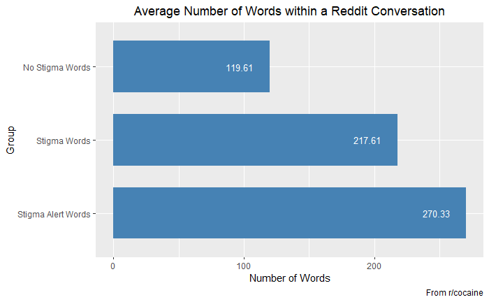
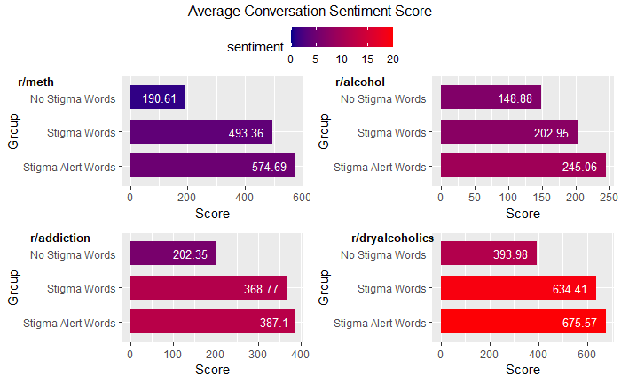

Here is a short summary of work I have done in my field of study.

## Public Science Collaborative

I interned with PSC, a public research organization at Iowa State University, during my last semester of college. I was a part of a team of three working on analyzing stigmatizing language in Reddit posts, specifically in forums centered around substance use and Substance Abuse Disorder (SUD). My primary focus was looking for trends between the use of stigma words and the average length of conversations, as well as tracking the sentiment of different groupings of posts. Most of the data cleaning and visualization was done in R while iterating through our dataset and generating our groups of interest was done using a python script. 

Some of the skills that I utilized or learned while working with PSC include
Using text sentiment dictionaries to run sentiment analysis on Reddit post data
Cleaning datasets in R
Creating informative visuals in R using the ggplot library
Using PowerBI to create visualization dashboards

The entirety of my analysis is in the report linked [here](conversation-length.html).

The rest of the work on the Stigma project can be found at the following Git Repository:
https://github.com/vksriharsha/PSC_Stigma

